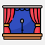

<html lang="en">
  <head>
    <meta charset="UTF-8">
    <meta name="viewport" content="width=device-width, initial-scale=1.0">
    <meta http-equiv="X-UA-Compatible" content="ie=edge">
    <title>Prof.Turatti</title>
    <link rel="stylesheet" href="./style.css">
    <link rel="icon" href="./favicon.ico" type="image/x-icon">

 

  </head>
<body>

  <table>
    <tr>
        <td><!-- 1 -->
            <a href="https://drive.google.com/file/d/12Yy-bXWH0BD7lz8zxchCLgcVW1jD41o2/view" target="_new">
              
               Calendário
            </a>
        </td>
        <!-- <td> -- 2 --
            <a href="&#109;ailto&#58;luiz&#46;tu&#114;&#97;tti&#64;profes&#115;ores&#46;&#117;n&#105;m&#101;trocamp&#46;edu&#46;br" target="_new">
              
               E-mail
            </a>
        </td>
        -->
        <!-- e-mail gmail -->
        <td> 
            <a href="&#109;ailto&#58;luiz&#46;tu&#114;&#97;tti&#64;docente&#46;unip&#46;br" target="_new">
              
               E-mail
            </a>
        </td>
        <td><!-- 4 -->
            <a href="https://github.com/profturatti/materiais/blob/main/README.md" target="_new">
              
               Materiais
            </a>
        </td>
        <!-- <td> -- 5 --
            <a href="https://forms.gle/FcoeJDk6mbbpSJ899" target="_new">
              
               Frequência
            </a>
        </td> -->
        <td><!-- 6 -->
            <a href="https://forms.gle/4HLRbMwNGGgsrzjDA" target="_new">
              
               Apresente-se
            </a>
        </td>
        <!-- <td>  -- 7 --
            <a href="url" target="_new">
              
               Grupos
            </a>
        </td> -->
    </tr>
  </table>

2026.1

<b>Prezado estudante, seja bem-vindo!</b>

<fieldset>
<legend style="color:MediumBlue;"><b>&nbsp;DISCIPLINAS&nbsp;</b></legend>
    Quarta-feira: <b>JAVA - POO (LAB)</b>
   &nbsp;
    Quinta-feira: <a href="https://github.com/profturatti/logica" target="_new"><b>LÓGICA (Teoria e LAB)</b></a>
   &nbsp;
</fieldset>
 &nbsp;

<fieldset>
<legend style="color:MediumBlue;"><b>&nbsp;MURAL DE AVISOS&nbsp;</b></legend>
   <b>CHAMADA:</b> Será passada lista em sala de aula.
   &nbsp;
  

</fieldset>
</body>
</html>
