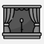

<html lang="en">
  <head>
    <meta charset="UTF-8">
    <meta name="viewport" content="width=device-width, initial-scale=1.0">
    <meta http-equiv="X-UA-Compatible" content="ie=edge">
    <title>Prof.Turatti</title>
    <link rel="stylesheet" href="./style.css">
    <link rel="icon" href="./favicon.ico" type="image/x-icon">

 

  </head>
<body>

<table>
    <tr>
        <td><!-- 1 -->
            <a href="calendario25s1.pdf" target="_new">
                
               Calendário Acadêmico
            </a>
        </td>
        <td><!-- 2 -->
            <a href="&#109;ailto&#58;luiz&#46;tu&#114;&#97;tti&#64;profes&#115;ores&#46;&#117;n&#105;m&#101;trocamp&#46;edu&#46;br" target="_new">
              
               E-mail Wyden
            </a>
        </td>
        <td><!-- 3 -->
            <a href="&#109;&#97;&#105;&#108;&#116;&#111;&#58;pr&#111;&#102;&#46;t&#117;&#114;&#97;tti&#64;&#103;mail&#46;c&#111;m" target="_new">
              
               E-mail GMail
            </a>
        </td>
        <td><!-- 4 -->
            <a href="https://github.com/profturatti/materiais/blob/main/README.md" target="_new">
              
               Materiais Complementares
            </a>
        </td>
        <td><!-- 5 -->
            <a href="https://forms.gle/fCiagxrVp2bRp8K28" target="_new">
              
               Frequência na aula
            </a>
        </td>
        <td><!-- 6 -->
            <!-- a href="https://forms.gle/c135Z5mdV9Hh8znT6" target="_new" -->
              
               Conhecendo o aluno
        </td>
        <td><!-- 7 -->
            <a href="https://forms.gle/QftrBCRmaoW3EWPo9" target="_new">
              
               Grupos de Projetos
            </a>
        </td>
    </tr>
</table>

<b>Prezado estudante, seja bem-vindo!</b>

<b>Acesse os conteúdos de sua disciplina 2025.1 através do nome da disciplina cursada: </b>
  <a href="https://github.com/profturatti/android" target="_new">Android</a> | 
  <a href="https://github.com/profturatti/pythonRAD" target="_new">Python RAD</a> 

<fieldset>
<legend style="color:MediumBlue;"><b>&nbsp;Mural de avisos&nbsp;</b></legend>
   <b>Formulários de preenchimento obrigatório</b>
  
Preencher a cada aula o Formulário de <b>frequência na aula</b> disponível no menu superior.

   <b>Android Studio Cloud</b> (BETA) - Acessível através do navegador, em fase de testes
  
Requer login do google no Firebase Studio, disponível 
     <a href="https://studio.firebase.google.com/new/android-studio?hl=pt-br" target="_new">aqui</a>

  
   <b>Histórico</b>
   1. Até 28/02/2025 Formulário para apresentação do aluno ao professor: <b>Conhecendo o aluno</b> (preencher somente uma vez) 
  
2. Até 28/02/2025 Formulário para indicação dos <b>grupos de projeto</b> nas disciplinas (equipe para trabalho semestral)
 
  
</fieldset>
</body>
</html>
